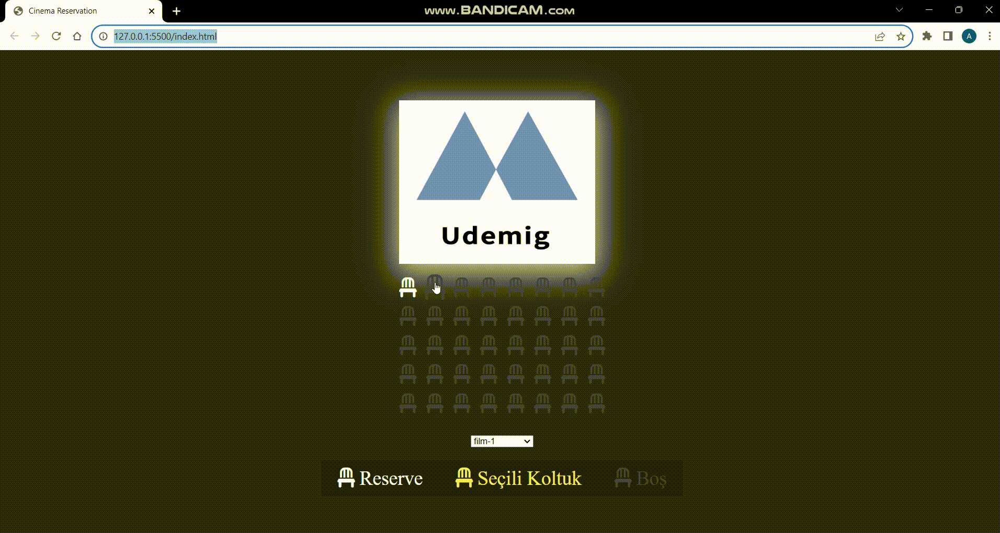

# CINEMA RESERVATION PROJECT

# USED TECHNOLOGIES
- HTML
- css
- javascript 
- Database Creation

# Project Objective
"This is a cinema reservation project where users can select their seats and view reserved seats."

# Roadmap

- -  tıklanılan koltuğun rengini değiştir ve tekrar tıklanılınca tersine çevir
- - Önce container divine eriş 
- - Bu dive olay dinleyicisi ekle
- - Tıklanılan elemanı tespit et 
- - Tespit ettiğin elemanın classında seat varsa onun classListine selected ekle
- - eğer selected classı varsa çıkar(yani toggle yap)
- - Eğer seçili koltuk yoksa info yazısı kalkacak varsa gelecek
- - Bunun için info-text class'ına eriş 
- - Sonra seçili koltuk olup olmadığı tespit edilecek
- - varsa info-text displayini değiştir
- - seçili koltuk sayısını ve toplam tutarı bilgi yazısında gösterme
- - seçili koltuk sayısını aktarmak için amount class'lı divi çek
- - bu divin innerText'ine selectedSeatsCount'u ver
- - film çekme kısmını filmlerin fiyat bilgisi için çek
- - ve toplam sayı ile bu değeri çarp
-  amount classlı spana ekle
